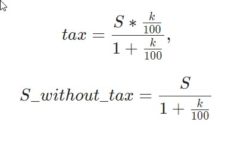

# Запросы, групповые операции

## Выбор уникальных элементов столбца

Чтобы отобрать уникальные элементы некоторого столбца, используется ключевое слово `DISTINCT`, которое размещается сразу  
после `SELECT`.

Запрос:
```sql
SELECT amount
FROM book
GROUP BY amount;
```
Пояснение:  
_Отобрать различные (уникальные) элементы столбца amount таблицы book._

Вывод:
```commandline
Query result:
+--------+
| amount |
+--------+
| 3      |
| 5      |
| 10     |
| 15     |
+--------+
Affected rows: 4
```
___

## Выборка данных, групповые функции SUM и COUNT

При группировке над элементами столбца, входящими в группу можно выполнить различные действия, например, просуммировать  
их или найти количество элементов в группе.

Если столбец указан в `SELECT` **БЕЗ** применения групповой функции, то он обязательно должен быть указан и в 
`GROUP BY`. Иначе получим ошибку.  

Запрос:
```sql
SELECT author AS Автор, 
COUNT(title) AS Различных_книг, 
SUM(amount) AS Количество_экземпляров
FROM book
GROUP BY author;
```
Пояснение:  
_Посчитать, количество различных книг и количество экземпляров книг каждого автора , хранящихся на складе.  Столбцы  
назвать Автор, Различных_книг и Количество_экземпляров соответственно._

Вывод:
```commandline
Query result:
+------------------+----------------+------------------------+
| Автор            | Различных_книг | Количество_экземпляров |
+------------------+----------------+------------------------+
| Булгаков М.А.    | 2              | 8                      |
| Достоевский Ф.М. | 3              | 23                     |
| Есенин С.А.      | 1              | 15                     |
+------------------+----------------+------------------------+
Affected rows: 3
```
___

## Выборка данных, групповые функции MIN, MAX и AVG

К групповым функциям SQL относятся: `MIN()`, `MAX()` и `AVG()`, которые вычисляют минимальное, максимальное и среднее  
значение элементов столбца, относящихся к группе.  


Запрос:
```sql
SELECT author, MIN(price) AS Минимальная_цена,
MAX(price) AS Максимальная_цена,
AVG(price) AS Средняя_цена
FROM book
GROUP BY author;
```
Пояснение:  
_Вывести фамилию и инициалы автора, минимальную, максимальную и среднюю цену книг каждого автора . Вычисляемые столбцы  
назвать Минимальная_цена, Максимальная_цена и Средняя_цена соответственно._

Вывод:
```commandline
Query result:
+------------------+------------------+-------------------+--------------+
| author           | Минимальная_цена | Максимальная_цена | Средняя_цена |
+------------------+------------------+-------------------+--------------+
| Булгаков М.А.    | 540.50           | 670.99            | 605.745000   |
| Достоевский Ф.М. | 460.00           | 799.01            | 579.836667   |
| Есенин С.А.      | 650.00           | 650.00            | 650.000000   |
+------------------+------------------+-------------------+--------------+
Affected rows: 3
```
___

## Выборка данных с вычислением, групповые функции

В качестве аргумента групповых функций SQL может использоваться не только столбец, но и любое допустимое в SQL  
арифметическое выражение.

Запрос:
```sql
SELECT author, ROUND(SUM(price*amount),2) AS Стоимость,
ROUND((SUM(price*amount)*(18/100))/(1+(18/100)),2) AS НДС,
ROUND((SUM(price*amount))/(1+(18/100)),2) AS Стоимость_без_НДС
FROM book
GROUP BY author;
```
Пояснение:  
_Для каждого автора вычислить суммарную стоимость книг S (имя столбца Стоимость), а также вычислить налог на  
добавленную стоимость для полученных сумм (имя столбца НДС ) , который включен в стоимость и составляет 18% (k=18), а  
также стоимость книг (Стоимость_без_НДС) без него. Значения округлить до двух знаков после запятой. В запросе для  
расчета НДС(tax) и Стоимости без НДС(S_without_tax) использовать следующие формулы:_



Вывод:
```commandline
Query result:
+------------------+-----------+---------+-------------------+
| author           | Стоимость | НДС     | Стоимость_без_НДС |
+------------------+-----------+---------+-------------------+
| Булгаков М.А.    | 4715.47   | 719.31  | 3996.16           |
| Достоевский Ф.М. | 11802.03  | 1800.31 | 10001.72          |
| Есенин С.А.      | 9750.00   | 1487.29 | 8262.71           |
+------------------+-----------+---------+-------------------+
Affected rows: 3
```
___

## Вычисления по таблице целиком

Групповые функции позволяют вычислять итоговые значения по всей таблице.

Запрос:
```sql
SELECT MIN(price) AS Минимальная_цена,
MAX(price) AS Максимальная_цена,
ROUND(AVG(price),2)AS Средняя_цена
FROM book;
```
Пояснение:  
_Вывести цену самой дешевой книги, цену самой дорогой и среднюю цену уникальных книг на складе. Названия столбцов  
`Минимальная_цена`, `Максимальная_цена`, `Средняя_цена` соответственно. Среднюю цену округлить до двух знаков после запятой._  

Вывод:
```commandline
Query result:
+------------------+-------------------+--------------+
| Минимальная_цена | Максимальная_цена | Средняя_цена |
+------------------+-------------------+--------------+
| 460.00           | 799.01            | 600.17       |
+------------------+-------------------+--------------+
Affected rows: 1
```
___

## Выборка данных по условию, групповые функции

В запросы с групповыми функциями можно включать условие отбора строк, которое в обычных запросах записывается после  
`WHERE`. В запросах с групповыми функциями вместо `WHERE` используется ключевое слово `HAVING` , которое размещается после  
оператора `GROUP BY`.

Запрос:
```sql
SELECT ROUND(AVG(price),2) AS Средняя_цена,
ROUND(SUM(price*amount),2) AS Стоимость
FROM book
WHERE amount BETWEEN 5 AND 14
```
Пояснение:  
_Вычислить среднюю цену и суммарную стоимость тех книг, количество экземпляров которых принадлежит интервалу от 5 до  
14, включительно. Столбцы назвать `Средняя_цена` и `Стоимость`, значения округлить до 2-х знаков после запятой._

Вывод:
```commandline
Query result:
+--------------+-----------+
| Средняя_цена | Стоимость |
+--------------+-----------+
| 493.67       | 12107.50  |
+--------------+-----------+
Affected rows: 1
```
___

## Выборка данных по условию, групповые функции, WHERE и HAVING

`WHERE` и `HAVING` могут использоваться в одном запросе. При этом необходимо учитывать порядок выполнения SQL запроса  
**на выборку на СЕРВЕРЕ**:

1. FROM
2. WHERE
3. GROUP BY
4. HAVING
5. SELECT
6. ORDER BY

Сначала определяется таблица, из которой выбираются данные (`FROM`), затем из этой таблицы отбираются записи в  
соответствии с условием `WHERE`, выбранные данные агрегируются (`GROUP BY`), из агрегированных записей выбираются те,  
которые удовлетворяют условию после `HAVING`. Потом формируются данные результирующей выборки, как это указано после  
`SELECT` (вычисляются выражения, присваиваются имена и пр.). Результирующая выборка сортируется, как указано после  
`ORDER BY`.

Запрос:
```sql
SELECT author, SUM(price*amount) AS Стоимость
FROM book
WHERE title NOT IN ('Идиот','Белая гвардия')
GROUP BY author
HAVING SUM(price*amount) > 5000
ORDER BY SUM(price*amount) DESC;
```
Пояснение:  
_Посчитать стоимость всех экземпляров каждого автора без учета книг «Идиот» и «Белая гвардия». В результат включить  
только тех авторов, у которых суммарная стоимость книг (без учета книг «Идиот» и «Белая гвардия») более 5000 руб.  
Вычисляемый столбец назвать Стоимость. Результат отсортировать по убыванию стоимости._

Вывод:
```commandline
Query result:
+------------------+-----------+
| author           | Стоимость |
+------------------+-----------+
| Есенин С.А.      | 9750.00   |
| Достоевский Ф.М. | 7202.03   |
+------------------+-----------+
Affected rows: 2
```
___