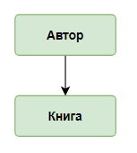
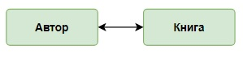
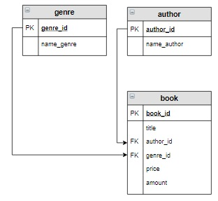

# Связи с таблицами
## Связь «один ко многим»

Связь «один ко многим» имеет место, когда одной записи главной таблицы соответствует несколько записей связанной  
таблицы, а каждой записи связанной таблицы соответствует только одна запись главной таблицы:



Пояснение:  
_Один автор может написать несколько книг, а одна книга написана только одним автором. Для каждой книги известны ее  
количество и цена._
___

## Связь «многие ко многим»

Связь «многие ко многим» имеет место когда каждой записи одной таблицы соответствует несколько записей во второй, и  
наоборот, каждой записи второй таблицы соответствует несколько записей в первой:



Пояснение:  
_Один автор может написать несколько книг, а одна книга может быть написана несколькими авторами. Для каждой книги  
известны ее количество и цена._
___

# Действия с связанными таблицами

## Создание таблицы с внешними ключами

При создании зависимой таблицы (таблицы, которая содержит внешние ключи) необходимо учитывать, что :

- каждый внешний ключ должен иметь такой же тип данных, как связанное поле главной таблицы;
- необходимо указать главную для нее таблицу и столбец, по которому осуществляется связь:  
```commandline
FOREIGN KEY (связанное_поле_зависимой_таблицы)  
REFERENCES главная_таблица (связанное_поле_главной_таблицы)
```

По умолчанию любой столбец, кроме ключевого, может содержать значение `NULL`. При создании таблицы это можно  
переопределить, используя ограничение `NOT NULL` для этого столбца:  
```commandline
CREATE TABLE таблица (
    столбец_1 INT NOT NULL, 
    столбец_2 VARCHAR(10) 
);
```

Пример создания таблицы **book**:

```sql
CREATE TABLE book (
    book_id INT PRIMARY KEY AUTO_INCREMENT, 
    title VARCHAR(50), 
    author_id INT NOT NULL,
    genre_id INT,
    price DECIMAL(8,2), 
    amount INT, 
    FOREIGN KEY (author_id)  REFERENCES author (author_id),
    FOREIGN KEY (genre_id) REFERENCES genre (genre_id)
);
```
Пояснение:  
- `FOREIGN KEY (author_id)` - столбец `author_id` **ТЕКУЩЕЙ** таблицы, будет зависеть от данных из другой таблицы;
- `REFERENCES author (author_id)` - от какой таблицы и столбца будет зависеть **ТЕКУЩИЙ** столбец `book.author_id`  
(от `author.author_id`).
___

## Действия при удалении записи главной таблицы

С помощью выражения `ON DELETE` можно установить действия, которые выполняются для записей подчиненной таблицы при  
удалении связанной строки из главной таблицы. При удалении можно установить следующие опции:

- `CASCADE` - автоматически удаляет строки из зависимой таблицы при удалении связанных строк в главной таблице;
- `SET NULL` - при удалении связанной строки из главной таблицы устанавливает для столбца внешнего ключа значение  
`NULL`. (В этом случае столбец внешнего ключа должен поддерживать установку `NULL`);
- `SET DEFAULT` похоже на `SET NULL` за тем исключением, что значение внешнего ключа устанавливается не в `NULL`, а в  
значение по умолчанию для данного столбца;
- `RESTRICT` - отклоняет удаление строк в главной таблице при наличии связанных строк в зависимой таблице.

_**Если для столбца установлена опция SET NULL, то при его описании нельзя задать ограничение на пустое значение.**_

Запрос:
```sql
CREATE TABLE book (
    book_id INT PRIMARY KEY AUTO_INCREMENT, 
    title VARCHAR(50), 
    author_id INT NOT NULL,
    genre_id INT,
    price DECIMAL(8,2), 
    amount INT, 
    FOREIGN KEY (author_id)  REFERENCES author (author_id) ON DELETE CASCADE,
    FOREIGN KEY (genre_id) REFERENCES genre (genre_id) ON DELETE SET NULL
);
```
Пояснение:  
_**Создать таблицу book той же структуры, что и на предыдущем шаге. Будем считать, что при удалении автора из таблицы  
author, должны удаляться все записи о книгах из таблицы book, написанные этим автором. А при удалении жанра из таблицы  
genre для соответствующей записи book установить значение Null в столбце genre_id._** 


