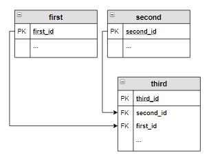

## Соединение INNER JOIN

Оператор внутреннего соединения `INNER JOIN` соединяет две таблицы. Порядок таблиц для оператора **неважен**, поскольку  
оператор является симметричным.

```sql
SELECT
 ...
FROM
    таблица_1 INNER JOIN  таблица_2
    ON условие
...
```
Результат запроса формируется так:

- каждая строка одной таблицы сопоставляется с каждой строкой второй таблицы;
- для полученной «соединённой» строки проверяется условие соединения;
- если условие истинно, в таблицу результата добавляется соответствующая «соединённая» строка;

Запрос:
```sql
SELECT title, name_genre, price
FROM
    book INNER JOIN genre
    ON book.genre_id = genre.genre_id
WHERE amount > 8
ORDER BY price DESC;

```
Пояснение:  
_**Вывести название, жанр и цену тех книг, количество которых больше 8, в отсортированном по убыванию цены виде.**_  

Вывод:  
```commandline
Query result:
+-----------------------+------------+--------+
| title                 | name_genre | price  |
+-----------------------+------------+--------+
| Стихотворения и поэмы | Поэзия     | 650.00 |
| Игрок                 | Роман      | 480.50 |
| Идиот                 | Роман      | 460.00 |
+-----------------------+------------+--------+
Affected rows: 3
```
#### P.S.

_**Вместо INNER JOIN можно писать просто JOIN, разницы никакой;**_
___

## Внешнее соединение LEFT и RIGHT OUTER JOIN

Оператор внешнего соединения `LEFT OUTER JOIN` (можно использовать `LEFT JOIN`) соединяет две таблицы. Порядок  
таблиц для оператора **важен**, поскольку оператор не является симметричным.

```sql
SELECT
 ...
FROM
    таблица_1 LEFT JOIN  таблица_2
    ON условие
...
```

Результат запроса формируется так:

- в результат включается внутреннее соединение (`INNER JOIN`) первой и второй таблицы в соответствии с условием;
- затем в результат добавляются те записи первой таблицы, которые не вошли во внутреннее соединение на шаге 1, для  
таких записей соответствующие поля второй таблицы заполняются значениями `NULL`.

_Соединение `RIGHT JOIN` действует аналогично, только в пункте 2 первая таблица меняется на вторую и наоборот._  

Запрос:
```sql
SELECT name_genre
FROM book RIGHT JOIN genre
ON book.genre_id = genre.genre_id
WHERE book.genre_id IS NULL
```
Пояснение:  
_**Вывести все жанры, которые не представлены в книгах на складе.**_  

Вывод:  
```commandline
Query result:
+-------------+
| name_genre  |
+-------------+
| Приключения |
+-------------+
Affected rows: 1
```
___

## Перекрестное соединение CROSS JOIN

Оператор перекрёстного соединения, или декартова произведения CROSS JOIN (в запросе вместо ключевых слов можно  
поставить запятую между таблицами) соединяет две таблицы. Порядок таблиц для оператора неважен, поскольку оператор  
является симметричным:
```sql
SELECT
 ...
FROM
    таблица_1 CROSS JOIN таблица_2
...
```
Результат запроса формируется так:  

- каждая строка одной таблицы соединяется с каждой строкой другой таблицы, формируя в результате все возможные  
сочетания строк двух таблиц.

Запрос:
```sql
SELECT name_author, name_genre
FROM 
    author, genre;
```
Пояснение:  
_**каждому автору из таблицы author поставит в соответствие все возможные жанры из таблицы genre**_  

Вывод:  
```commandline
Query result:
+------------------+-------------+
| name_author      | name_genre  |
+------------------+-------------+
| Булгаков М.А.    | Роман       |
| Булгаков М.А.    | Поэзия      |
| Булгаков М.А.    | Приключения |
| Достоевский Ф.М. | Роман       |
| Достоевский Ф.М. | Поэзия      |
| Достоевский Ф.М. | Приключения |
| Есенин С.А.      | Роман       |
| Есенин С.А.      | Поэзия      |
| Есенин С.А.      | Приключения |
| Пастернак Б.Л.   | Роман       |
| Пастернак Б.Л.   | Поэзия      |
| Пастернак Б.Л.   | Приключения |
| Лермонтов М.Ю.   | Роман       |
| Лермонтов М.Ю.   | Поэзия      |
| Лермонтов М.Ю.   | Приключения |
+------------------+-------------+
```
___

## Запросы на выборку из нескольких таблиц

Запрос на выборку может выбирать данные из двух и более таблиц базы данных. При этом таблицы должны быть логически  
связаны между собой. Для каждой пары таблиц, включаемых в запрос, необходимо указать свой оператор соединения.  
Наиболее распространенным является внутреннее соединение `INNER JOIN`, поэтому в примерах будем использовать его.  

Пусть таблицы связаны между собой следующим образом:  

  

тогда запрос на выборку для этих таблиц будет иметь вид:  

```sql
SELECT
 ...
FROM
    first 
    INNER JOIN  second ON first.first_id = second.first_id
    INNER JOIN  third  ON second.second_id = third.second_id
...
```

Если же таблицы связаны так:  

  

то запрос на выборку выглядит следующим образом:  

```sql
SELECT
 ...
FROM
    first 
    INNER JOIN  third ON first.first_id = third.first_id
    INNER JOIN second ON third.second_id = second.second_id 
...
```
___

## Запросы для нескольких таблиц с группировкой

В запросах с групповыми функциями могут использоваться несколько таблиц, между которыми используются различные  
типы соединений.  

Запрос:  
```sql
SELECT name_author, SUM(amount)  Количество
FROM author a LEFT JOIN book b ON a.author_id = b.author_id
GROUP BY name_author
HAVING Количество < 10 OR Количество IS NULL
ORDER BY Количество
```

Пояснение:  
_Посчитать количество экземпляров книг каждого автора из таблицы author.  Вывести тех авторов, количество книг которых  
меньше 10, в отсортированном по возрастанию количества виде. Последний столбец назвать Количество._  

Вывод:  
```commandline
Query result:
+----------------+------------+
| name_author    | Количество |
+----------------+------------+
| Лермонтов М.Ю. | NULL       |
| Пастернак Б.Л. | 2          |
| Булгаков М.А.  | 8          |
+----------------+------------+
Affected rows: 3
```
___

## Запросы для нескольких таблиц со вложенными запросами

В запросах, построенных на нескольких таблицах, можно использовать вложенные запросы. Вложенный запрос может быть  
включен: после ключевого слова `SELECT`, после `FROM` и в условие отбора после WHERE`` (`HAVING`).  

Запрос:  
```sql
SELECT name_author
FROM author INNER JOIN book USING(author_id)
GROUP BY name_author
HAVING COUNT(distinct(genre_id)) = 1
ORDER BY name_author;
```

Пояснение:  
_Вывести в алфавитном порядке всех авторов, которые пишут только в одном жанре. Поскольку у нас в таблицах так  
занесены данные, что у каждого автора книги только в одном жанре, для этого запроса внесем изменения в таблицу book.  
Пусть у нас книга Есенина «Черный человек» относится к жанру «Роман», а книга Булгакова «Белая гвардия» к  
«Приключениям» (эти изменения в таблицы уже внесены)._  

Вывод:  
```commandline
Query result:
+------------------+
| name_author      |
+------------------+
| Достоевский Ф.М. |
| Пастернак Б.Л.   |
+------------------+
Affected rows: 2
```
___

## Вложенные запросы в операторах соединения

Вложенные запросы могут использоваться в операторах соединения `JOIN`. При этом им необходимо присваивать имя, которое  
записывается сразу после закрывающей скобки вложенного запроса. 

```sql
SELECT
 ...
FROM
    таблица ... JOIN  
       (
        SELECT ...
       ) имя_вложенного_запроса
    ON условие
..
```

Вложенный запрос может стоять как справа, так и слева от оператора `JOIN`. Допускается использование двух запросов в  
операторах соединения.  

Запрос:  
```sql
SELECT  title, name_author, name_genre, price, amount
FROM 
    author 
    INNER JOIN book ON author.author_id = book.author_id
    INNER JOIN genre ON  book.genre_id = genre.genre_id
GROUP BY name_author,name_genre, genre.genre_id, title, price, amount
HAVING genre.genre_id IN
         (
          SELECT query_in_1.genre_id
          FROM 
              ( 
                SELECT genre_id, SUM(amount) AS sum_amount
                FROM book
                GROUP BY genre_id
               )query_in_1
          INNER JOIN 
              ( 
                SELECT genre_id, SUM(amount) AS sum_amount
                FROM book
                GROUP BY genre_id
                ORDER BY sum_amount DESC
                LIMIT 1
               ) query_in_2
          ON query_in_1.sum_amount= query_in_2.sum_amount
         )
ORDER BY title;   
```

Пояснение:  
_Вывести информацию о книгах (название книги, фамилию и инициалы автора, название жанра, цену и количество экземпляров  
книг), написанных в самых популярных жанрах, в отсортированном в алфавитном порядке по названию книг виде. Самым  
популярным считать жанр, общее количество экземпляров книг которого на складе максимально._  

Вывод:  
```commandline
Query result:
+-----------------------+------------------+------------+--------+--------+
| title                 | name_author      | name_genre | price  | amount |
+-----------------------+------------------+------------+--------+--------+
| Белая гвардия         | Булгаков М.А.    | Роман      | 540.50 | 5      |
| Братья Карамазовы     | Достоевский Ф.М. | Роман      | 799.01 | 3      |
| Игрок                 | Достоевский Ф.М. | Роман      | 480.50 | 10     |
| Идиот                 | Достоевский Ф.М. | Роман      | 460.00 | 10     |
| Лирика                | Пастернак Б.Л.   | Поэзия     | 518.99 | 10     |
| Мастер и Маргарита    | Булгаков М.А.    | Роман      | 670.99 | 3      |
| Стихотворения и поэмы | Есенин С.А.      | Поэзия     | 650.00 | 15     |
| Черный человек        | Есенин С.А.      | Поэзия     | 570.20 | 6      |
+-----------------------+------------------+------------+--------+--------+
Affected rows: 8
```
___

## Операция соединение, использование USING()

При описании соединения таблиц с помощью `JOIN` в некоторых случаях вместо `ON` и следующего за ним условия можно  
использовать оператор `USING()`.

`USING` позволяет указать набор столбцов, которые есть в обеих объединяемых таблицах. Если база данных хорошо  
спроектирована, а каждый внешний ключ имеет такое же имя, как и соответствующий первичный ключ (например,  
`genre.genre_id = book.genre_id`), тогда можно использовать предложение `USING` для реализации операции `JOIN`.  

При этом после `SELECT`, при использовании столбцов из `USING()`, необязательно указывать, из какой именно таблицы  
берется столбец.

Вариант с `ON`:
```sql
SELECT title, name_author, author.author_id /* явно указать таблицу - обязательно */
FROM 
    author INNER JOIN book
    ON author.author_id = book.author_id;
```

Вариант с `USING`:
```sql
SELECT title, name_author, author_id /* имя таблицы, из которой берется author_id, указывать не обязательно*/
FROM 
    author INNER JOIN book
    USING(author_id);
```
___


