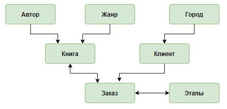
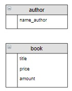
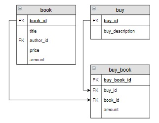

## Проектирование концептуальной модели базы данных

Будет построена концептуальная модель базы данных, затем ее логическая модель. Также будут определены структура и  
содержание таблиц базы данных «Интернет-магазин книг».

### Шаг 1.  

Детально проанализировать предметную область и выделить те информационные объекты, которые будут храниться в базе  
данных:  

>_В интернет-магазине продаются **книги**. Каждая книга имеет название, написана одним **автором**, относится к одному **жанру**,  
имеет определенную цену. В магазине в наличии есть несколько экземпляров каждой книги._  

>_**Покупатель** регистрируется на сайте интернет-магазина, задает свое имя и фамилию, электронную почту и **город** проживания  
(для упрощения считаем, что человек не может поменять свой город проживания). Он может сформировать один или несколько  
**заказов**, для каждого заказа написать какие-то пожелания. Каждый заказ включает одну или несколько книг, каждую книгу  
можно заказать в нескольких экземплярах. Затем заказ проходит ряд последовательных **этапов** (операций): оплачивается, упаковывается,  
передается курьеру или транспортной компании для транспортировки и, наконец, доставляется покупателю. Фиксируется  
дата каждой операции. Для каждого города известно среднее время доставки книг._  

>_При этом в магазине ведется учет книг, при покупке их количество уменьшается, при поступлении товара увеличивается,  
при исчерпании количества – оформляется заказ и пр._

### Шаг 2.

Для каждого выделенного информационного объекта указать его характеристики, для этого:

Сначала выделить их в описании предметной области:  

>_В интернет-магазине продаются **книги**. Каждая книга имеет **название**, написана одним **автором**, относится к одному  
**жанру**, имеет определенную **цену**. В магазине в наличии есть **несколько экземпляров** каждой книги._ 

>_**Покупатель** регистрируется на сайте интернет-магазина, задает свое **имя** и **фамилию**, **электронную почту** и **город** проживания.  
Он может сформировать один или несколько **заказов**, для каждого заказа написать какие-то **пожелания**. Каждый заказ  
включает **одну** или **несколько книг**, каждую книгу можно заказать в **нескольких экземплярах**. Затем заказ проходит ряд  
последовательных этапов(операций): оплачивается, упаковывается, передается курьеру или транспортной компании для  
транспортировки и, наконец, доставляется покупателю. Фиксируется **дата каждой операции**. Для каждого города известно  
**среднее время доставки книг**._

>_При этом в магазине ведется учет книг, при покупке их количество уменьшается, при поступлении товара увеличивается,  
при исчерпании количества – оформляется заказ и пр._

Затем связать их с информационным объектом:  

  * Книга – название, количество, цена;
  * Автор – фамилия и инициалы;
  * Жанр – название;
  * Покупатель (клиент) – фамилия и имя, электронная почта;
  * Город – название, среднее время доставки;
  * Заказ – код заказа, пожелания;
  * Этап – название этапов.  

Перечислить характеристики, которые остались не привязанными к информационным объектам (к ним необходимо вернуться при  
реализации связей между таблицами):

  * книги в заказе;
  * количество книг в заказе;
  * дата каждой операции.

### Шаг 3.  

Нарисовать схему, на которой изобразить информационные объекты в виде прямоугольников:  

### Шаг 4.  

Установить связи между информационными объектами. Связь «**один ко многим**» обозначить в виде **→**, «**многие ко многим**» – **↔**.  

* Каждая **книга** написана одним **автором**, каждый **автор** написал несколько **книг**, следовательно, между этими таблицами связь  
«один ко многим»:

  

* Каждая **книга** может включаться в несколько **заказов**, один **заказ** может содержать несколько **книг**, между этими таблицами  
связь «многие ко многим»:  

  

* Каждый **клиент** может сформировать несколько **заказов**, каждый **заказ** формируется только одним **клиентом**:  

  
___

## Построение логической схемы базы данных

Концептуальная модель выглядит следующим образом:

   

На основе этой модели создается логическая модель, в которой информационные объекты описываются в виде реляционных  
таблиц.

### Шаг 1. 

Разработать структуру таблиц для каждого информационного объекта. Таблица в качестве столбцов должна включать все  
характеристики информационного объекта, полученные на этапе концептуального проектирования, кроме тех, которые  
соответствуют названиям других информационных объектов. Они будут включены в таблицы при создании связей.  

Информационный объект:  

  

будет иметь структуру:  

  

Информационный объект:  

  

будет иметь структуру:  

  

### Шаг 2. 

Реализовать связь между таблицами.  

«один ко многим»:

 

«многие ко многим»:  

  

(В описании предметной области указывается, что нужно хранить количество книг, которые включены в заказ.)

  

Конечная схема БД:

___

